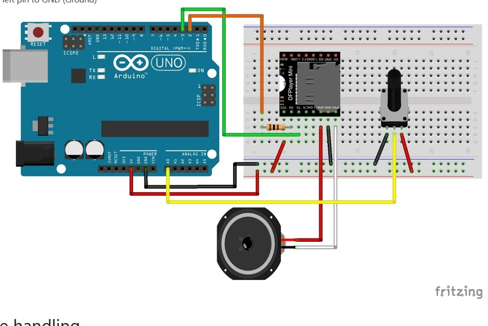

# Welcome to Animal Fire Alarm!  

Prototyp für einen Feueralarm für Tiere in Waldbrandgebieten - Prototype for a fire alarm for animals in wildfire-prone areas

by **Jabora Speder, July 2025**

## Also became part of our [TechTales exhibition!](https://github.com/reallaborwald/tech-tales)

## Hardware 

## Documentation (German)

Presentation slides: [here](docs/Presentation_jabora%20Speder_fire%20alarm.pdf)

Documentation: [here](docs/Documentation_animal%20fire%20alarm_jabora%20speder.pdf)

## Links 

[Our website lifolab](https://www.lifolab.de)

[Fachgebiet Nachrichtenübertragung an der Technischen Universität Berlin](https://www.tu.berlin/nue)
